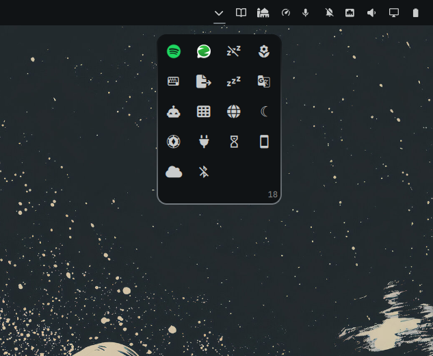

# Den



A Windows-style overflow flyout for the [Omarchy](https://omarchy.org) shell
bar. Clicking the chevron drops down a compact grid of icon tiles holding
every tray app that isn't pinned on the stock tray, plus any bar plugins
tucked away inside. Strictly a declutter tool — Den never enables, disables,
or removes anything.

## Why

New tray apps and plugin widgets pile up on the bar. Den gives them one home:
unpinned tray apps appear automatically, and any bar widget can be dragged in
— leaving your bar minimal and your overflow one click away.

## Gestures

| Action | How |
|---|---|
| Open / close | click the chevron |
| Tuck a widget away | press-and-hold it anywhere on the bar → drop on the glowing chevron or the open card |
| Show again | drag the tile onto the eject strip at the top of the card ("Release to show") |
| Show at an exact spot | plugins only — drag the tile out of the card and drop it between two bar widgets |
| Activate | left-click a tile (apps launch; plugins toggle their panel under the card) |
| App menu | right-click an app tile — full menu with submenus, rendered inline |
| Send plugin back | right-click a plugin tile |
| Reorder | hold a tile, hover a landing slot (accent ring), release |

Middle-click and scroll behave like normal tray icons. The chevron always
points toward the flyout: down on a top bar, up on a bottom bar, inward on
left/right bars.

## Plugin icons

Omarchy plugins carry no icon metadata, so tile faces resolve through a
fallback chain:

1. manual overrides — add an `icons` map to Den's entry in
   `~/.config/omarchy/shell.json`:
   ```json
   { "id": "so.den", "widgets": ["..."], "icons": { "omaplug": "\uf013" } }
   ```
2. optional manifest convention — `icon` or `barWidget.icon` accepts a Nerd
   Font glyph or an image path (relative paths resolve against the plugin dir)
3. live extraction of the widget's actual bar-button glyph from its mounted
   instance
4. letter avatar

Tray apps always render their real icon (symbolic icons are tinted to match
your theme).

## Install

```sh
omarchy plugin add https://github.com/SaifOmar/so.den.git --enable
```

That's it. Place it on your bar:

```sh
omarchy bar move so.den --section right
```

## Uninstall

```sh
omarchy plugin remove so.den
```

### Settings

All settings live on Den's entry in `~/.config/omarchy/shell.json`:

- `widgets` — which bar plugins are tucked away (managed by dragging; edit by
  hand if you prefer)
- `captureOverflow` — default `true`. Registers unpinned tray ids as hidden on
  the stock tray so its own hover-expander stays empty and Den becomes the
  single overflow. Set to `false` to leave the stock tray alone.
- `icons` — per-plugin icon overrides, see above.

## Files

- `manifest.json` — plugin metadata (bar-widget kind)
- `Den.qml` — the widget
- `DenModel.js` — pure config/tray helpers

## License

[MIT](LICENSE)
